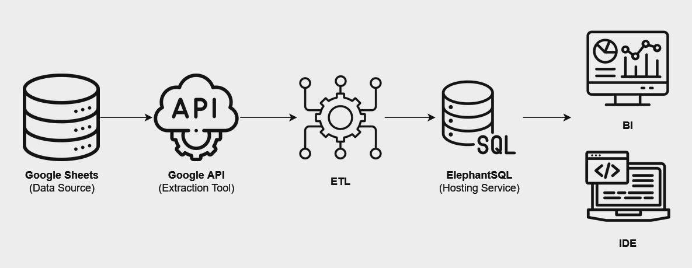

# Google Sheets to PostgreSQL ETL Pipeline

This project is a python-based ETL (Extract, Transform, Load) pipeline that automates the extraction of data from Google Sheets, transforms the data as needed, and loads it into a PostgreSQL database hosted on ElephantSQL. It's designed to streamline the process of data handling, making it easier to perform insightful data analysis in the cloud.

|  |
|:--:| 
| *Data Flow Diagram* |

## Features
- **Data Extraction**: Automatically fetches data from Google Sheets using the Google Sheets API.
- **Data Transformation**: Processes and prepares data to fit the desired schema for database insertion.
- **Data Loading**: Efficiently loads transformed data into a PostgreSQL database, ensuring data integrity and consistency.
- **Dynamic Date Filtering**: Allows data extraction from a specified start date, enabling incremental data updates.
- **Logging**: Comprehensive logging throughout the ETL process for easy monitoring and debugging.

## Technologies Used
- **Python**: Primary programming language for scripting the ETL process.
- **Pandas**: Used for data manipulation and transformation.
- **SQLAlchemy**: Facilitates database interaction.
- **PostgreSQL**: Robust and scalable open-source database system.
- **ElephantSQL**: Cloud-hosted PostgreSQL service providing the database backend.
- **Google Sheets API**: Enables programmatic access to Google Sheets for data extraction.

## Setup
To run this project, you'll need to have Python installed on your system, along with the necessary Python packages:

1. Clone the repository to your local machine:
```ruby
git clone https://github.com/Mvanhuffel/Sheets_to_Postgres_ETL_Pipeline.git
```

2. Navigate to the project directory:
```ruby
cd Sheets_to_Postgres_ETL_Pipeline
```

3. Install the required Python packages:
```ruby
pip install -r requirements.txt
```

## Usage
To start the ETL process, run the main.py script from the command line. Ensure you are in the project root directory:
```ruby
python src/main.py
```
*Ensure your config.yaml file is set up with the correct parameters before running the script. If you haven't already, copy `config.example.yaml` to `config.yaml` and edit it with your settings.*

## Project Structure:

```ruby
Sheets to SQL/
├── .git/                # Git version control system directory
├── .gitignore           # Specifies intentionally untracked files to ignore
├── _pycache_/           # Compiled Python files
├── data/                # Data files, like your Google service account JSON
├── env_sts/             # Virtual environment directory
├── logs/                # Log files directory
│   └── data_ingestion.log
├── src/                 # Source code directory
│   ├── extract.py       # Your extraction script
│   ├── load.py          # Your loading script
│   └── main.py          # Main script that orchestrates the ETL process
├── README.md            # Project documentation
├── requirements.txt     # Python package dependencies
└── config.yaml          # Configuration file 
```

## License
This project is licensed under the MIT License - see the [LICENSE](https://www.mit.edu/~amini/LICENSE.md) file for details.

